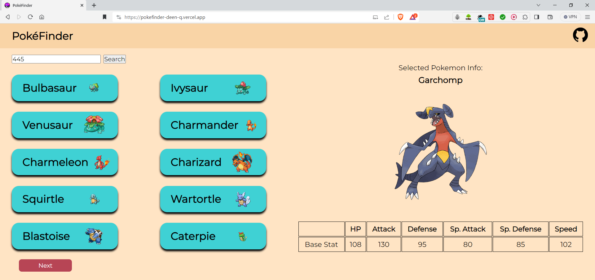

# PokéFinder
A simple 'PokeDex' i.e., an encyclopedia of Pokemon. The first React I created by myself to help solidify my understanding, back when I was still new to React 🤓
 
 
The site can be found at this link (also on the right hand side of this page): [https://github.com/Deen-q/PokeFinder](https://pokefinder-deen-q.vercel.app/).
          
## Screenshot

## Status
I have hosted PokéFinder since the base app is complete. I did have more plans for improvement, but I put it on the back-burner because:
- The job market for junior roles is incredibly cut-throat right now and a basic Pokémon app doesn't make me stand out. I have since focused on more intense projects focused around cloud microservices and .NET.
- It was primarily a learning tool during the beginning of my journey.
- There are already incredible apps that exist already that do this job (Pokémon Showdown and Serebii for example).
- I got bored since the app is quite simple. Extra features would not really develop my skills to the level I would like. Still, I'm proud of how far I've come 😁

## Credit:
Special thanks to <a href='https://github.com/Kirti-salunkhe'>Kirti Salunkhe</a>'s YouTube video. DESIGN wise, I was inspired to split the page into 2 sections, one for cards and the other for info. Usually I like to customise things entirely to my liking, but the colour palette really resonated with me.
 
Note: the code is completely different in my project. Regardless, the tutorial was very useful at the time.
